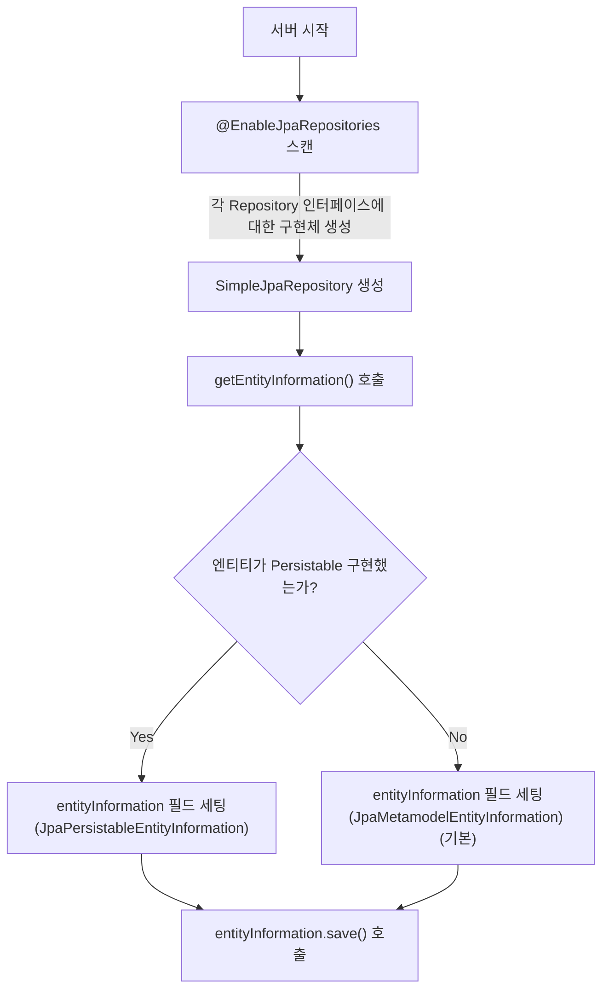
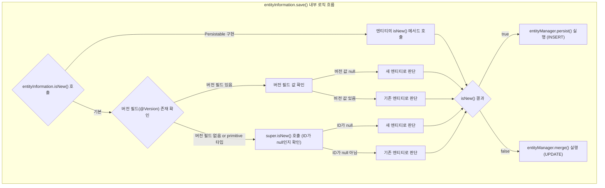

<br>
<br>
<br>

# 2025.05.19
## TCP 3-way handshake에 대해서 설명해주세요.

### TCP(Transmission Control Protocol)란?
TCP는 애플리케이션 간 신뢰성 있는 데이터 전송을 보장하는 연결 지향형(Connection-oriented) 프로토콜이다. 통신을 시작하기 전에 서로 연결을 설정하고, 끝나면 정상적으로 종료하는 과정이 필요하다. 이러한 연결 설정과 해제 과정에서 사용하는 절차가 각각 3-way handshake와 4-way handshake이다.

### 3-way Handshake
3-way handshake는 TCP 연결을 수립할 때 사용하는 통신 패턴으로, 클라이언트와 서버가 서로의 존재를 확인하고, SEQ 번호를 교환하며, 연결 준비가 되었음을 확인한다.

#### 단계
1. SYN (Synchronize): 클라이언트가 서버에 연결 요청을 보냄
- SEQ 번호(SEQ=X) 포함    
   → 클라이언트 상태: SYN_SENT
   → 서버 상태: LISTEN 
  
2. SYN + ACK (Synchronize + Acknowledgement): 서버가 SYN을 받고 수락하며 응답
- 클라이언트의 SEQ+1을 ACK로 보내고, 자신의 SEQ도 함께 전송  
   → 클라이언트 상태: SYN_SENT  
   → 서버 상태: SYN_RECEIVED  
  
3. ACK (Acknowledgement): 클라이언트가 서버의 응답을 확인했다는 ACK 전송
- 서버의 SEQ+1을 ACK로 전송  
   → 클라이언트 상태: ESTABLISHED  
   → 서버 상태: ESTABLISHED 

### 4-way Handshake
4-way handshake는 TCP 연결을 종료할 때 사용하는 종료 절차이다. TCP는 양방향(Full Duplex) 통신을 지원하기 때문에, 각 방향을 독립적으로 종료해야 하므로 4단계가 필요하다.

#### 단계
1. FIN (클라이언트 → 서버): 클라이언트가 연결 종료 요청  
   → 클라이언트 상태: FIN_WAIT_1  
   → 서버 상태: ESTABLISHED  
  
2. ACK (서버 → 클라이언트): 서버가 FIN 수신 후 ACK 전송  
   → 클라이언트 상태: FIN_WAIT_2  
   → 서버 상태: CLOSE_WAIT  
  
3. FIN (서버 → 클라이언트): 서버도 종료 요청  
   → 클라이언트 상태: FIN_WAIT_2  
   → 서버 상태: LAST_ACK  
  
4. ACK (클라이언트 → 서버): 클라이언트가 서버의 FIN에 응답  
   → 클라이언트 상태: TIME_WAIT → (일정 시간 후) CLOSED  
   → 서버 상태: CLOSED  

> ##### TIME_WAIT 필요성
> ```
> 클라이언트: 종료 요청할게 (FIN)  
> 서버: 알겠어! (ACK)  
> 서버: 나도 이제 종료할게 (FIN)  
> 클라이언트: 알겠어! (ACK) 그런데 혹시 내가 보낸 마지막 데이터가 아직 네트워크 어딘가에 남아 있을 수 있으니까 잠깐 기다렸다가 완전히 닫을게 (TIME_WAIT)  
> ```
> - FIN 재전송 대응: 서버가 마지막 FIN에 대한 ACK를 못 받았을 때, 다시 FIN을 보내면 클라이언트가 그에 응답할 수 있도록 하기 위함
> - 지연된 패킷 처리: 서버가 FIN 전에 보낸 지연된 데이터 패킷이 나중에 도착할 수 있는데, 이걸 기존 연결로 정상 처리하고, 새 연결과 혼동되지 않게 하기 위함
{: .block-tip }

### 취약점: SYN Flood 공격
3-way handshake의 구조적 특성을 악용한 공격으로 공격자가 SYN 요청만 보내고 ACK를 보내지 않을 경우, 서버는 연결을 대기 상태(SYN_RECEIVED)로 유지하며 메모리와 큐를 점유
위와 같은 상황이 반복되면 정상 연결도 못 받는 DoS 상태가 발생한다.

#### 대응 방법
- SYN Cookie: 서버가 연결 요청을 메모리에 저장하지 않고, 응답 시 SEQ 번호에 암호화된 연결 정보를 포함시켜 저장공간을 사용하지 않도록 하는 기술
- Connection Rate 제한: 초당 SYN 요청 수 제한 설정 (IPTables의 --limit 모듈, Nginx의 limit_conn 등)
- TCP Proxy 도입: 요청 앞단에서 먼저 handshake 처리

### TCP에서 SEQ / ACK 번호가 필요한 이유 
- SEQ(SEQ 번호): 내가 보내는 데이터가 전체 중 어디서부터 시작되는지를 나타냄
- ACK(응답 번호): 내가 상대방의 데이터를 어디까지 받았는지를 알려줌 (상대 SEQ + 1)

#### 필요성
- 데이터 순서 보장: 패킷이 뒤죽박죽 와도 순서대로 정렬 가능
- 손실 감지 및 재전송: ACK가 안 오면 TCP가 자동으로 재전송
- 중복 제거: 같은 데이터가 여러 번 와도 구분 가능
- 정상적인 연결 수립/종료 관리: 3-way / 4-way handshake에서도 정확한 번호 교환이 필수

> ##### SEQ / ACK 번호 변화 예시(임의의 숫자이며 실제로는 ISN(Initial Sequence Number)이 랜덤하게 생성됨)
> * SYN/FIN의 경우 데이터는 없지만 1바이트 데이터 처럼 간주하여 `상대 SEQ + 1`  (클라이언트가 SEQ=100으로 SYN을 보내면, 서버는 ACK=101로 응답)
> * 실제 데이터 전송의 경우, 전송한 바이트 수 만큼 `상대 SEQ + 전송한 바이트 수` (아래 표 HTTP 데이터 전송 4번의 SEQ 참고)
> #### TCP 3-way Handshake
> 
> | 단계 | 출발지 → 목적지     | Flags  | SEQ           | ACK           | 설명                            |
> |------|---------------------|--------|---------------|---------------|---------------------------------|
> | 1    | 클라이언트 → 서버   | `[S]`  | 3113377296    | -             | 클라이언트가 연결 요청 (SYN)   |
> | 2    | 서버 → 클라이언트   | `[S.]` | 1171478793    | 3113377297    | 서버가 SYN+ACK 응답             |
> | 3    | 클라이언트 → 서버   | `[.]`  | 3113377297    | 1171478794    | 서버의 SEQ+1에 대한 ACK 전송   |
>
> #### HTTP 데이터 전송
> 
> | 단계 | 출발지 → 목적지     | Flags  | SEQ                     | ACK           | 설명                                      |
> |------|---------------------|--------|-------------------------|---------------|-------------------------------------------|
> | 4    | 클라이언트 → 서버   | `[P.]` | 3113377297 → 3113378141 | 1171478794    | 844 바이트 HTTP 요청 전송 (PSH+ACK)       |
> | 5    | 서버 → 클라이언트   | `[.]`  | 1171478794              | 3113378141    | 요청 데이터 수신 확인 (ACK=마지막+1)     |
> 
> #### TCP 4-way Handshake
> 
> | 단계 | 출발지 → 목적지     | Flags  | SEQ           | ACK           | 설명                                  |
> |------|---------------------|--------|---------------|---------------|---------------------------------------|
> | 6    | 클라이언트 → 서버   | `[F.]` | 3113378141    | 1171478794    | 클라이언트가 연결 종료 요청           |
> | 7    | 서버 → 클라이언트   | `[.]`  | 1171478794    | 3113378142    | 서버가 FIN 수신 확인 (ACK 전송)       |
> | 8    | 서버 → 클라이언트   | `[F.]` | 1171478795    | 3113378142    | 서버도 종료 요청 (FIN 전송)           |
> | 9    | 클라이언트 → 서버   | `[.]`  | 3113378142    | 1171478796    | 서버 FIN 수신 확인 (최종 ACK 전송)   |
{: .block-tip }

### 실습 - 터미널에서 확인하기(ephemeral port)
- OS: MacOS
- 클라이언트: `127.0.0.1:60661`
- 서버: `127.0.0.1:8080`

#### 준비
1. port 열기
```shell
nc -l 8080 &
```

2. port 확인
```shell
lsof -i :8080
```
```
COMMAND   PID     FD   TYPE   SIZE/OFF  NODE NAME
nc        12345   3u   IPv4   0t0       TCP *:8080 (LISTEN)
```

3. tcpdump 확인(브라우저에서 `localhost:8080` 접속)
> Loopback 인터페이스(127.0.0.1와 같은 IPv4 루프백 주소를 사용해서 자기 자신에게 네트워크 요청을 하는 것)는 송신과 수신이 모두 캡처되기 때문에 클라이언트와 서버가 동일 호스트일 경우, 동일 세션의 양방향 패킷이 모두 관측됨

```shell
sudo tcpdump -i any tcp port 8080 -n
```

```shell
# 3-way handshake
14:33:34.647984 IP 127.0.0.1.60661 > 127.0.0.1.8080: Flags [S]     # 1. SYN
14:33:34.648219 IP 127.0.0.1.8080 > 127.0.0.1.60661: Flags [S.]    # 2. SYN-ACK  
14:33:34.648268 IP 127.0.0.1.60661 > 127.0.0.1.8080: Flags [.]     # 3. ACK

# 4-way handshake
14:33:36.361347 IP 127.0.0.1.60661 > 127.0.0.1.8080: Flags [F.]    # 1. FIN
14:33:36.361385 IP 127.0.0.1.8080 > 127.0.0.1.60661: Flags [.]     # 2. ACK
14:33:36.361403 IP 127.0.0.1.8080 > 127.0.0.1.60661: Flags [F.]    # 3. FIN
14:33:36.361427 IP 127.0.0.1.60661 > 127.0.0.1.8080: Flags [.]     # 4. ACK
```

> ##### 플래그 설명
> #### 3-way handshake
> - [S]   → SYN (클라이언트 → 서버)
> - [S.]  → SYN+ACK (서버 → 클라이언트)
> - [.]   → ACK (클라이언트 → 서버)
> 
> #### 4-way handshake
> - [F.]  → FIN (종료 요청)
> - [.]   → ACK (종료 요청 확인)
> - [F.]  → FIN (상대방 종료 요청)
> - [.]   → ACK (종료 응답)
{: .block-tip }

---

<br>
<br>
<br>

# 2025.05.05
## 일급 컬렉션이 무엇인가요?
### 정의
- 일급 컬렉션(First-class Conllection)은 객체 지향 프로그래밍에서 컬렉션을 하나의 클래스로 포장하여 관련 동작과 책임을 함께 캡슐화하는 것을 의미한다.

### 왜 필요할까?
1. 비즈니스 규칙 캡슐화: 컬렉션에 적용되는 비즈니스 규칙을 한 곳에서 관리할 수 있다.
2. 데이터와 로직의 응집도 향상: 데이터(컬렉션)와 그 데이터를 다루는 로직이 함께 존재하여 응집도가 높아진다.
3. 불변성 보장: 컬렉션을 불변 객체로 만들어 안전한 프로그래밍이 가능하다.
4. 명확한 의미 전달: 컬렉션의 의도와 목적을 명확히 표현할 수 있다.

### 언제 써야할까?
- 컬렉션에 의미 있는 이름을 붙이고 싶을 때
- **비즈니스 로직(검증, 계산 등)**을 포함하고 싶을 때
- 불변성을 유지하고 외부 변경을 막고 싶을 때
- 컬렉션이 여러 곳에서 반복적으로 사용될 때

### 장/단점
- 장점
    - 캡슐화 강화: 컬렉션 조작을 클래스 내부로 제한하여 일관성 유지
    - 높은 응집도: 관련 기능이 한 곳에 모여 코드 관리가 용이
    - 의미있는 이름 사용: `List<User>` 대신 `UserGroup`과 같은 도메인 용어 사용
    - 비즈니스 규칙 명확화: 컬렉션 관련 제약조건을 코드로 표현
    - 테스트 용이성: 컬렉션 관련 동작을 독립적으로 테스트 가능
    - 변경에 유연: 내부 구현 변경이 외부에 영향을 주지 않음

- 단점
    - 코드량 증가: 간단한 컬렉션도 별도 클래스 필요
    - 학습 곡선: 패턴에 익숙하지 않은 개발자에게 진입장벽 존재
    - 경미한 성능 오버헤드: 추가적인 객체 생성으로 인한 부담
    - 과도한 추상화 위험: 모든 컬렉션에 적용 시 불필요한 복잡성 초래  

> ##### 성능 오버헤드 테스트
> 
> 목적: 객체 생성/메서드 접근 등의 오버헤드가 실제 실행 시간에 유의미한 영향이 있는지 실험  
> [링크](https://github.com/han-chunsik/dev-lab/blob/main/java-performance/src/jmh/java/firstclasscollection/docs/2025_05_05_FirstClassCollection.md)
{: .block-tip }

### 코드 수정
```java
// 기존 코드
@Transactional
public void activateSeatList(List<Long> seatIdList) {
    seatIdList.stream()
        .map(seatId -> concertSeatRepository.findSeatById(seatId).orElse(null))
            .filter(Objects::nonNull)
            .forEach(seat -> {seat.setSeatAvailable();
            concertSeatRepository.save(seat);
        });
}
```

```java
...
// 1. 일급 클래스 생성
public class SeatIds {
    private final List<Long> values;

    public SeatIds(List<Long> values) {
        this.values = new ArrayList<>(values);
    }

    public List<Long> getValues() {
        return Collections.unmodifiableList(values);
    }
}
...

...
// 2. 컬렉션 객체 생성
public class Seats {
    private final List<ConcertSeat> seats;

    public Seats(List<ConcertSeat> seats) {
        this.seats = new ArrayList<>(seats);
    }

    public void activateAll() {
        seats.forEach(ConcertSeat::setSeatAvailable);
    }

    public List<ConcertSeat> getSeats() {
        return Collections.unmodifiableList(seats);
    }
}
...

...
// 3. 서비스 수정
@Transactional
public void activateSeatList(SeatIds seatIds) {
    List<ConcertSeat> foundSeats = seatIds.getValues().stream()
        .map(seatId -> concertSeatRepository.findSeatById(seatId).orElse(null))
        .filter(Objects::nonNull)
        .collect(Collectors.toList());

    Seats seats = new Seats(foundSeats);
    seats.activateAll();

    concertSeatRepository.saveAll(seats.getSeats());
}
...
```


---

<br>
<br>
<br>

#  2025.04.28
## Spring Data JPA에서 새로운 Entity인지 판단하는 방법은 무엇일까요?  
### 왜 구분이 필요할까?  
- JPA(EntityManager)는 새로운 Entity는 `persist()` 로 저장하고, 이미 DB의 있는 것을 수정하거나, 준영속 상태의 데이터를 다시 영속화 할 때 `merge()`를 사용한다.  
- Spring Data JPA의 기본 SimpleJpaRepository 구현체는 `save()` 호출 시 내부적으로 새 Entity인지 판단하여 `persist()` 또는 `merge()`를 수행한다.  
  
### Spring Data JPA의 새로운 Entity 판별 과정
**1. `save()` 호출 → 내부적으로 `isNew()` 호출**
- `entityInformation.isNew(entity)`로 `persist()`, `merge()` 결정

    ```java
        @Override
        @Transactional
        public <S extends T> S save(S entity) {

            Assert.notNull(entity, ENTITY_MUST_NOT_BE_NULL);

            if (entityInformation.isNew(entity)) {
                entityManager.persist(entity);
                return entity;
            } else {
                return entityManager.merge(entity);
            }
        }
    ```

**2. `isNew()` 에서 version 필드 확인**
- `@version` 이 있을 경우, version 필드가 null이면 `persist()`, 값이 있으면 `merge()`  
- `@version` 이 없을 경우 or primitive 타입일 경우(null일 수 없는 기본 타입) `super.isNew()` 호출

    ```java
    @Override
    public boolean isNew(T entity) {

        if (versionAttribute.isEmpty()
                || versionAttribute.map(Attribute::getJavaType).map(Class::isPrimitive).orElse(false)) {
            return super.isNew(entity); 
        }

        BeanWrapper wrapper = new DirectFieldAccessFallbackBeanWrapper(entity);

        return versionAttribute.map(it -> wrapper.getPropertyValue(it.getName()) == null).orElse(true);
    }
    ```

**3. `super.isNew()` → ID 확인**
- ID가 null이면 → 새 Entity
- ID가 있으면 → 기존 Entity

    ```java
    @Transient
    @Override
    public boolean isNew() {
        return null == getId();
    }
    ```

### 수동으로 ID를 지정하는 경우
- `Persistable`를 구현하여 `isNew()`를 오버라이드

    ```java
    @MappedSuperclass
    public abstract class AbstractEntity<ID> implements Persistable<ID> {

    @Transient  // 영속화 대상이 아님
    private boolean isNew = true; 

    @Override
    public boolean isNew() {
        return isNew; 
    }

    @PrePersist  // 영속화 되기 직전
    @PostLoad    // 데이터 베이스에서 조회된 직후
    void markNotNew() {
        this.isNew = false;
    }

    // More code…
    }
    ```

### 전체 흐름
- 수동 지정 및 primitive 타입 사용 => Persistable 구현해서 isNew() 명시
- 자동 생성(@GeneratedValue) => Wrapper 타입(Long, Integer 등) 사용





