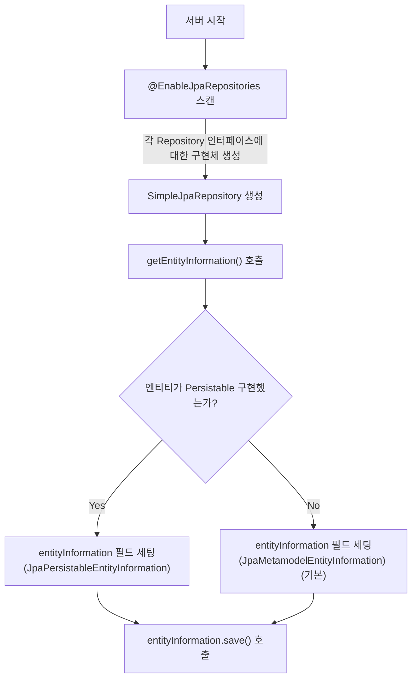
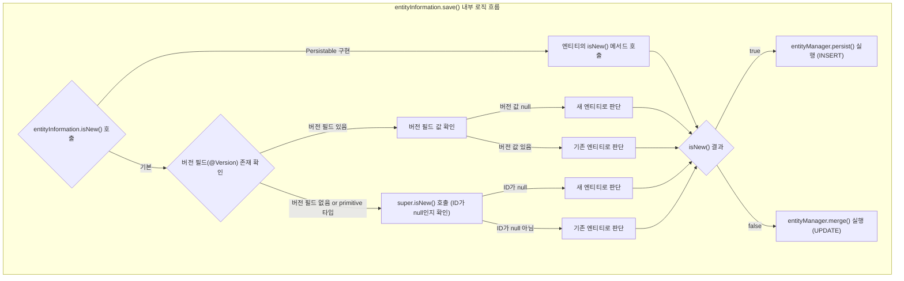

#  2025.04.28
## Spring Data JPA에서 새로운 Entity인지 판단하는 방법은 무엇일까요?  
### 왜 구분이 필요할까?  
- JPA(EntityManager)는 새로운 Entity는 `persist()` 로 저장하고, 이미 DB의 있는 것을 수정하거나, 준영속 상태의 데이터를 다시 영속화 할 때 `merge()`를 사용한다.  
- Spring Data JPA의 기본 SimpleJpaRepository 구현체는 `save()` 호출 시 내부적으로 새 Entity인지 판단하여 `persist()` 또는 `merge()`를 수행한다.  
  
### Spring Data JPA의 새로운 Entity 판별 과정
**1. `save()` 호출 → 내부적으로 `isNew()` 호출**
- `entityInformation.isNew(entity)`로 `persist()`, `merge()` 결정

    ```java
        @Override
        @Transactional
        public <S extends T> S save(S entity) {

            Assert.notNull(entity, ENTITY_MUST_NOT_BE_NULL);

            if (entityInformation.isNew(entity)) {
                entityManager.persist(entity);
                return entity;
            } else {
                return entityManager.merge(entity);
            }
        }
    ```

**2. `isNew()` 에서 version 필드 확인**
- `@version` 이 있을 경우, version 필드가 null이면 `persist()`, 값이 있으면 `merge()`  
- `@version` 이 없을 경우 or primitive 타입일 경우(null일 수 없는 기본 타입) `super.isNew()` 호출

    ```java
    @Override
    public boolean isNew(T entity) {

        if (versionAttribute.isEmpty()
                || versionAttribute.map(Attribute::getJavaType).map(Class::isPrimitive).orElse(false)) {
            return super.isNew(entity); 
        }

        BeanWrapper wrapper = new DirectFieldAccessFallbackBeanWrapper(entity);

        return versionAttribute.map(it -> wrapper.getPropertyValue(it.getName()) == null).orElse(true);
    }
    ```

**3. `super.isNew()` → ID 확인**
- ID가 null이면 → 새 Entity
- ID가 있으면 → 기존 Entity

    ```java
    @Transient
    @Override
    public boolean isNew() {
        return null == getId();
    }
    ```

### 수동으로 ID를 지정하는 경우
- `Persistable`를 구현하여 `isNew()`를 오버라이드

    ```java
    @MappedSuperclass
    public abstract class AbstractEntity<ID> implements Persistable<ID> {

    @Transient  // 영속화 대상이 아님
    private boolean isNew = true; 

    @Override
    public boolean isNew() {
        return isNew; 
    }

    @PrePersist  // 영속화 되기 직전
    @PostLoad    // 데이터 베이스에서 조회된 직후
    void markNotNew() {
        this.isNew = false;
    }

    // More code…
    }
    ```

### 전체 흐름
- 수동 지정 및 primitive 타입 사용 => Persistable 구현해서 isNew() 명시
- 자동 생성(@GeneratedValue) => Wrapper 타입(Long, Integer 등) 사용





