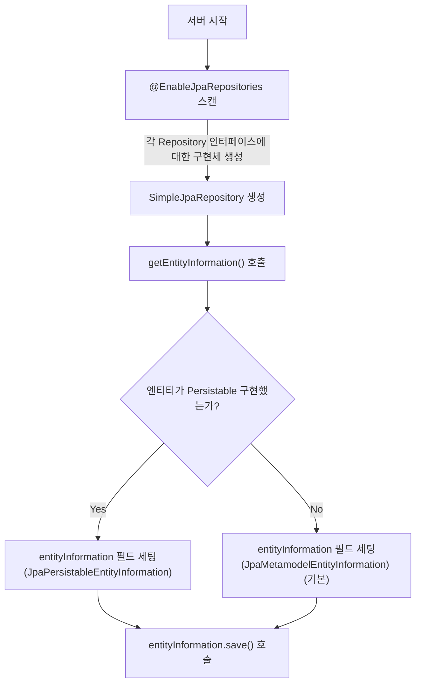
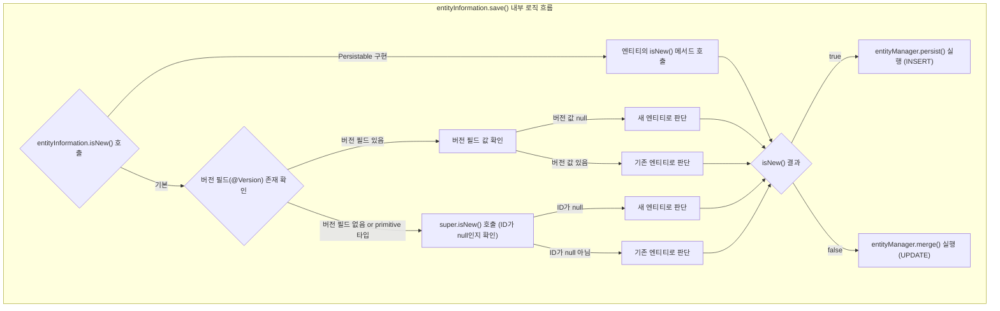

<br>
<br>
<br>

# 2025.05.05
## 일급 컬렉션이 무엇인가요?
### 정의
- 일급 컬렉션(First-class Conllection)은 객체 지향 프로그래밍에서 컬렉션을 하나의 클래스로 포장하여 관련 동작과 책임을 함께 캡슐화하는 것을 의미한다.

### 왜 필요할까?
1. 비즈니스 규칙 캡슐화: 컬렉션에 적용되는 비즈니스 규칙을 한 곳에서 관리할 수 있다.
2. 데이터와 로직의 응집도 향상: 데이터(컬렉션)와 그 데이터를 다루는 로직이 함께 존재하여 응집도가 높아진다.
3. 불변성 보장: 컬렉션을 불변 객체로 만들어 안전한 프로그래밍이 가능하다.
4. 명확한 의미 전달: 컬렉션의 의도와 목적을 명확히 표현할 수 있다.

### 언제 써야할까?
- 컬렉션에 의미 있는 이름을 붙이고 싶을 때
- **비즈니스 로직(검증, 계산 등)**을 포함하고 싶을 때
- 불변성을 유지하고 외부 변경을 막고 싶을 때
- 컬렉션이 여러 곳에서 반복적으로 사용될 때

### 장/단점
- 장점
    - 캡슐화 강화: 컬렉션 조작을 클래스 내부로 제한하여 일관성 유지
    - 높은 응집도: 관련 기능이 한 곳에 모여 코드 관리가 용이
    - 의미있는 이름 사용: `List<User>` 대신 `UserGroup`과 같은 도메인 용어 사용
    - 비즈니스 규칙 명확화: 컬렉션 관련 제약조건을 코드로 표현
    - 테스트 용이성: 컬렉션 관련 동작을 독립적으로 테스트 가능
    - 변경에 유연: 내부 구현 변경이 외부에 영향을 주지 않음

- 단점
    - 코드량 증가: 간단한 컬렉션도 별도 클래스 필요
    - 학습 곡선: 패턴에 익숙하지 않은 개발자에게 진입장벽 존재
    - 경미한 성능 오버헤드: 추가적인 객체 생성으로 인한 부담
    - 과도한 추상화 위험: 모든 컬렉션에 적용 시 불필요한 복잡성 초래  

> ##### 성능 오버헤드 테스트
> 
> 목적: 객체 생성/메서드 접근 등의 오버헤드가 실제 실행 시간에 유의미한 영향이 있는지 실험  
> [링크](https://github.com/han-chunsik/dev-lab/blob/main/java-performance/src/jmh/java/firstclasscollection/docs/2025_05_05_FirstClassCollection.md)
{: .block-tip }

### 코드 수정
```java
// 기존 코드
@Transactional
public void activateSeatList(List<Long> seatIdList) {
    seatIdList.stream()
        .map(seatId -> concertSeatRepository.findSeatById(seatId).orElse(null))
            .filter(Objects::nonNull)
            .forEach(seat -> {seat.setSeatAvailable();
            concertSeatRepository.save(seat);
        });
}
```

```java
...
// 1. 일급 클래스 생성
public class SeatIds {
    private final List<Long> values;

    public SeatIds(List<Long> values) {
        this.values = new ArrayList<>(values);
    }

    public List<Long> getValues() {
        return Collections.unmodifiableList(values);
    }
}
...

...
// 2. 컬렉션 객체 생성
public class Seats {
    private final List<ConcertSeat> seats;

    public Seats(List<ConcertSeat> seats) {
        this.seats = new ArrayList<>(seats);
    }

    public void activateAll() {
        seats.forEach(ConcertSeat::setSeatAvailable);
    }

    public List<ConcertSeat> getSeats() {
        return Collections.unmodifiableList(seats);
    }
}
...

...
// 3. 서비스 수정
@Transactional
public void activateSeatList(SeatIds seatIds) {
    List<ConcertSeat> foundSeats = seatIds.getValues().stream()
        .map(seatId -> concertSeatRepository.findSeatById(seatId).orElse(null))
        .filter(Objects::nonNull)
        .collect(Collectors.toList());

    Seats seats = new Seats(foundSeats);
    seats.activateAll();

    concertSeatRepository.saveAll(seats.getSeats());
}
...
```


---

<br>
<br>
<br>

#  2025.04.28
## Spring Data JPA에서 새로운 Entity인지 판단하는 방법은 무엇일까요?  
### 왜 구분이 필요할까?  
- JPA(EntityManager)는 새로운 Entity는 `persist()` 로 저장하고, 이미 DB의 있는 것을 수정하거나, 준영속 상태의 데이터를 다시 영속화 할 때 `merge()`를 사용한다.  
- Spring Data JPA의 기본 SimpleJpaRepository 구현체는 `save()` 호출 시 내부적으로 새 Entity인지 판단하여 `persist()` 또는 `merge()`를 수행한다.  
  
### Spring Data JPA의 새로운 Entity 판별 과정
**1. `save()` 호출 → 내부적으로 `isNew()` 호출**
- `entityInformation.isNew(entity)`로 `persist()`, `merge()` 결정

    ```java
        @Override
        @Transactional
        public <S extends T> S save(S entity) {

            Assert.notNull(entity, ENTITY_MUST_NOT_BE_NULL);

            if (entityInformation.isNew(entity)) {
                entityManager.persist(entity);
                return entity;
            } else {
                return entityManager.merge(entity);
            }
        }
    ```

**2. `isNew()` 에서 version 필드 확인**
- `@version` 이 있을 경우, version 필드가 null이면 `persist()`, 값이 있으면 `merge()`  
- `@version` 이 없을 경우 or primitive 타입일 경우(null일 수 없는 기본 타입) `super.isNew()` 호출

    ```java
    @Override
    public boolean isNew(T entity) {

        if (versionAttribute.isEmpty()
                || versionAttribute.map(Attribute::getJavaType).map(Class::isPrimitive).orElse(false)) {
            return super.isNew(entity); 
        }

        BeanWrapper wrapper = new DirectFieldAccessFallbackBeanWrapper(entity);

        return versionAttribute.map(it -> wrapper.getPropertyValue(it.getName()) == null).orElse(true);
    }
    ```

**3. `super.isNew()` → ID 확인**
- ID가 null이면 → 새 Entity
- ID가 있으면 → 기존 Entity

    ```java
    @Transient
    @Override
    public boolean isNew() {
        return null == getId();
    }
    ```

### 수동으로 ID를 지정하는 경우
- `Persistable`를 구현하여 `isNew()`를 오버라이드

    ```java
    @MappedSuperclass
    public abstract class AbstractEntity<ID> implements Persistable<ID> {

    @Transient  // 영속화 대상이 아님
    private boolean isNew = true; 

    @Override
    public boolean isNew() {
        return isNew; 
    }

    @PrePersist  // 영속화 되기 직전
    @PostLoad    // 데이터 베이스에서 조회된 직후
    void markNotNew() {
        this.isNew = false;
    }

    // More code…
    }
    ```

### 전체 흐름
- 수동 지정 및 primitive 타입 사용 => Persistable 구현해서 isNew() 명시
- 자동 생성(@GeneratedValue) => Wrapper 타입(Long, Integer 등) 사용





