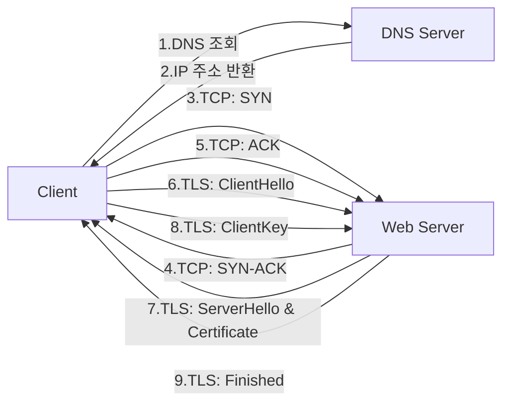

 
 
 

# 2025.04.25
## 좋은 재시도, 나쁜 재시도(Good Retry, Bad Retry: An Incident Story)
> - [링크](https://medium.com/yandex/good-retry-bad-retry-an-incident-story-648072d3cee6)
> - 출처: 웹사이트
> - 작성자/출판사: Denis Isaev

### 핵심 내용 요약  
이 글은 800개의 마이크로서비스 시스템에서 오류 처리를 위해 적용한 재시도 기능으로 인해 발생한 문제들을 다룬다.  
  
개발자는 주문 서비스의 시간초과 오류를 해결하기 위해 간단한 재시도 루프를 구현했으나, 이러한 재시도가 '재시도 폭풍'을 일으킬 수 있다는 피드백을 받았고, 이를 방지하기 위해 지수적 백오프(exponential backoff)와 지터(jitter)를 구현하여 문제를 해결했다고 생각한다.  
  
그러나 시스템의 규모가 성장했을 때, 1시간 동안 전체 백엔드가 다운되는 사고가 발생했고, 문제가 되는 버전을 10분 만에 롤백했지만 시스템은 회복되지 않았다. 트래픽을 사용자의 1%로 제한한 후에야 시스템이 복구되기 시작했다.  
  
분석 결과, 백오프와 지터 방식은 부하 증폭을 해결하지 않고 단순히 지연시킬 뿐이었다. 원인이 제거된 후에도 재시도로 인한 부하 증폭이 시스템 복구를 방해했으며, 재시도가 없었다면 시스템은 원인 제거 후 거의 즉시 복구될 수 있었다.  
    
이 문제를 해결하기 위해 3가지 방법을 테스트 했다.  
1. 재시도 회로 차단기(Retry Circuit Breaker): 서비스 오류 비율이 특정 임계값을 초과하면 재시도를 비활성화  
2. 재시도 예산(Retry Budget): 항상 재시도를 허용하되, 성공 요청 수의 일정 비율 내로 제한  
3. 데드라인 전파(Deadline Propagation): 클라이언트가 각 요청에 대한 최대 응답 시간을 지정하고, 이 시간이 만료되면 요청을 중단  
  
최종적으로 팀은 10% 임계값으로 재시도 예산 기술을 채택했고, 이후 다른 장애가 발생했지만 재시도로 인한 증폭은 관찰되지 않았다.  
  
이 사례는 "일시적인 오류가 발생하면 재시도를 추가하라"는 접근법이 생각보다 위험할 수 있음을 보여준다. 재시도는 신중하게 구현하고 적절히 제한해야 시스템 안정성을 개선할 수 있다.  

### 주요 개념/용어
- Edge case: 정상적인 입력이나 동작 범위의 극한 값 또는 조건에서 발생하는 문제    
- Corner case: 여러 조건이 동시에 비정상적인 상태로 겹칠 때 발생하는 예외적인 상황    
- Retry Storm: 서비스에 문제가 발생했을 때, 다수의 클라이언트가 동시에 재시도를 수행하여 부하를 급격히 증가시키는 현상    
- Exponential Backoff: 재시도 간격을 점점 길게 설정하는 전략    
- Jitter: 재시도 간격에 무작위성을 추가하는 기법  
- Open-loop: 출력 결과에 대한 피드백 없이 고정된 방식으로 계속 동작하는 구조  
- closed-loop: 출력 결과나 시스템 상태에 대한 피드백을 반영하여 동작 조절  
- Metastable Failure State, MFS: 시스템이 장애 원인이 제거된 후에도 자체적으로 회복하지 못하는 상태  
- Load Amplification: 재시도로 인해 서버가 처리해야할 요청이 증가하는 현상  
- Retry Circuit Breaker: 서비스 오류 비율이 임계값을 초과하면 재시도를 비활성화하는 패턴  
- Retry Budget: 성공한 요청수의 일정 비율 이내로 재시도를 재한하는 방식  
- Deadline Propagation: 클라이언트가 각 요청에 최대 응답시간을 지정하고, 서버가 이 시간 초과 시 요청을 중단하는 기법  

### 중요 포인트
"Sometimes, a seemingly simple and obvious solution can lead to a series of problems later on"  

어떤 문제들은 단순한 해결책이 명확하게 보일 떄가 있다. 예를들어, 같은 데이터를 반복해서 불러오는데 속도가 느리면 자연스럽게 캐시를 도입하는 경우처럼 말이다. 재시도도 일시적인 오류가 발생하면 재시도를 추가하면 된다고 생각하기 쉽지만, 충분한 시뮬레이션이나 고려 없이 단순한 해결책만 적용했을 때는 오히려 더 큰 문제를 가져오기도 한다.  

### 고찰
문제를 해결하기 위해 기술을 도입하거나 로직을 변경할 때, 발생할 수 있는 문제들을 미리 예측하려고 노력하지만, 그건 정말 어려운 일인 것 같다.    
결국 이런 감각은 경험을 하면서 쌓이는 거라고 생각한다.    
앞으로도 계속 경험을 쌓아가게 될텐데, 문제를 해결하는 방식이 가져올 수 있는 부작용까지 예측할 수 있는 시니어 엔지니어가 될 수 있도록 계속 노력해야겠다.  

### 관련 글
- [Retry Storm antipattern](https://learn.microsoft.com/en-us/azure/architecture/antipatterns/retry-storm/)  
- [Retry with backoff pattern](https://docs.aws.amazon.com/prescriptive-guidance/latest/cloud-design-patterns/retry-backoff.html)
- [Open-loop and closed-loop](https://en.wikipedia.org/wiki/Control_loop#Open-loop_and_closed-loop)  
- [What is Backoff For?](https://brooker.co.za/blog/2022/08/11/backoff.html)
- [Exponential Backoff And Jitter](https://aws.amazon.com/ko/blogs/architecture/exponential-backoff-and-jitter/)
- [Postmortem Culture: Learning from Failure](https://sre.google/sre-book/postmortem-culture/)

---

 
 
 

# 2025.04.16
## SOLID: 자바 클래스 설계의 다섯 가지 기본 원칙
> - [링크](https://codegym.cc/ko/groups/posts/ko.232.solid-jaba-keullaeseu-seolgyeui-daseos-gaji-gibon-wonchig)
> - 출처: 웹사이트
> - 작성자/출판사: John Squirrels

### 핵심 내용 요약  
자바 클래스 설계의 5가지 기본 원칙인 SOLID에 대해 설명한다. SOLID는 2000년대 초반 Robert Martin이 표현하고 Miceael Feathers가 약어로 만든 객체지향 프로그래밍(OOP)의 핵심 원칙이다.

1. 단일 책임 원칙(SRP)
2. 개방 폐쇄 원칙(OCP)
3. 리스코프 치환 원칙(LSP)
4. 인터페이스 분리 원칙(ISP)
5. 의존성 역전 원칙(ISP)  

### 주요 개념/용어
1. 단일 책임 원칙(SRP): 각 클래스는 하나의 책임만 가져야 한다.
2. 개방 폐쇄 원칙(OCP): 기존 코드를 변경하지 않고 동작을 확장할 수 있어야 한다.(상속을 통한 기존 클래스 기능 확장)
3. 리스코프 치환 원칙(LSP): 하위(서브) 클래스는 상위(슈퍼) 클래스를 대체할 수 있어야 한다.
4. 인터페이스 분리 원칙(ISP): 클라이언트는 사용하지 않는 메서드를 구현하도록 강요받지 않아야 한다.
5. 의존성 역전 원칙(DIP): 상위 모듈은 하위 모듈에 의존하지 않고, 둘 다 추상화에 의존해야 한다.

### 중요 포인트
"OOP와 Java 프로그래밍의 기본 사항(지루하지 않고 수백 시간의 연습)에 대해 자세히 배우게 됩니다."   
  
Java의 기본을 익히려면 수백 시간의 연습이 필요하다는 걸 느꼈다. 개발은 배울 게 정말 많아서 좋다. 꾸준히 차근차근 쌓아가야겠다.

### 고찰
객체지향은 정말 공부할수록 재미있는 것 같다. 객체에 역할과 책임을 잘 부여하려면 어떤 방식이 필요한지, 그런 고민 끝에 SOLID 같은 원칙이 만들어졌다는 게 정말 대단하다.  
  
개발이 재밌는 이유는 퍼즐을 하나씩 맞춰가듯 공부하다 보면 어느 순간 그것들이 모여 하나의 큰 그림이 되는 데 있는 것 같다. 객체지향의 개념을 제대로 이해하고 나니, SOLID 원칙들이 자연스럽게 받아들여지기 시작했다.    
    
클래스는 단지 객체를 코드로 표현하는 도구일 뿐이니, 여기서는 ‘객체’라고 부르겠다.  
    
**단일 책임 원칙(SRP)**은, 객체가 다른 객체들과 메시지를 주고받으며 협력하는 구조 속에서, 각 객체는 자신의 행동과 역할에만 책임을 지면 된다는 뜻이다.  
      
**개방-폐쇄 원칙(OCP)**과 **리스코프 치환 원칙(LSP)**은 연결된다. 상위 객체(슈퍼클래스)에 책임을 잘 설계해두면, 그 구조를 확장하는 하위 객체는 자연스럽게 기존 구조를 깨지 않고 새로운 기능을 덧붙일 수 있다. 이때 하위 객체가 상위 객체를 완전히 대체할 수 있어야 한다는 점은 너무나 당연해 보인다.     
   
**인터페이스 분리 원칙(ISP)**은, 굳이 관련 없는 객체들끼리 연결될 필요는 없다는 생각에서 비롯된 것 같다. 객체 간 관계는 필요한 만큼만 명확하게 맺어져야 한다.   
    
**의존성 역전 원칙(DIP)**은, 객체가 어떤 요청을 수행하는지에 대한 내부 구현은 외부 모듈이 알 필요가 없다는 데에서 출발한다. 객체는 무엇을 해야 하는지만 외부에 드러내고, 어떻게 할지는 자신만 알고 있으면 되는 거다.  
   
히히 재미쪙

---

 
 
 

# 2025.04.15
## 웹페이지를 표시한다는 것: 브라우저는 어떻게 동작하는가
> - [링크](https://developer.mozilla.org/ko/docs/Web/Performance/Guides/How_browsers_work)    
> - 출처: 웹사이트  
> - 작성자/출판사: MDN Web Docs  

### 핵심 내용 요약  
빠른 사이트는 좋은 사용자 경험을 제공한다. 실제 성능 및 체감 성능을 향상시키는 방법을 이해하기 위해서는 브라우저의 동작 방식을 이해하는 것이 도움이 된다.  
  
브라우저가 웹 페이지를 표사하는 과정은 다음과 같다.  
    
1. 탐색 (Navigation)  
- DNS 조회: 도메인 이름을 IP 주소로 변환  
- TCP 연결: 3-way 핸드셰이크로 서버와 연결 구축  
- TLS 협상: HTTPS 사용 시 보안 연결 설정  
  
2. 데이터 수신 (Response)   
- 서버에서 HTML 파일 등의 요청 자원 다운로드
- TCP 슬로우 스타트를 통한 데이터 전송 최적화
  
3. 구문 분석 (Parsing)
- DOM 트리 구축: HTML을 구문 분석하여 DOM 트리 생성
- 프리로드 스캐너: 우선순위가 높은 자원(CSS, JS, 폰트) 미리 요청
- CSSOM 구축: CSS를 분석하여 스타일 객체 모델 생성
- JavaScript 컴파일: 스크립트 처리 및 실행
    
4. 렌더링 (Render)
- 스타일: DOM과 CSSOM을 결합하여 렌더 트리 생성
- 레이아웃: 각 요소의 크기와 위치 계산
- 페인트: 픽셀을 화면에 그리기
- 합성: 여러 레이어를 적절한 순서로 결합
  
5. 상호작용 (Interactivity)
- 페이지가 사용자 입력에 응답할 준비가 됨
- TTI(Time to Interactive): 사용자와 상호작용 가능한 시점까지의 시간
  
a. 최적화 핵심 포인트  
- 메인 스레드 부하 줄이기 (대부분의 브라우저는 싱글 스레드)
- JavaScript 파일에 async/defer 속성 사용하기
- 필요한 리소스는 같은 호스트에서 제공하여 DNS 조회 최소화
- 이미지 크기를 미리 지정하여 리플로우 방지
- 페이지 로딩과 상호작용성 모두를 고려한 최적화 필요

### 주요 개념/용어  
- DNS 조회(DNS Lookup): 도메인 이름을 IP 주소로 변환하는 과정
- TCP 핸드셰이크(TCP Handshake): 브라우저와 서버 간의 연결을 설정하는 3단계 과정(SYN-SYN-ACK)
- TLS 협상(TLS Negotiation): HTTPS 연결을 위한 보안 핸드셰이크 과정
- TTFB(Time to First Byte): 요청 후 첫 데이터 바이트를 받는 데 걸린 시간
- 혼잡 제어(Congestion control): 네트워크 부하에 따라 데이터 전송량을 조절하는 메커니즘
- TCP 슬로우 스타트(TCP Slow Start): 최대 네트워크 대역폭을 결정하기 위해 점진적으로 데이터 전송량을 늘리는 알고리즘
- DOM(Document Object Model): HTML을 브라우저가 이해할 수 있는 객체 모델로 변환한 트리 구조
- CSSOM(CSS Object Model): CSS를 브라우저가 이해할 수 있는 객체 모델로 변환한 트리 구조
- 프리로드 스캐너(Preload scanner): DOM 트리 구축 중 병렬로 우선순위가 높은 자원을 미리 요청하는 기능
- 렌더 트리(Render Tree): DOM과 CSSOM을 결합하여 화면에 표시될 요소들만 포함한 트리
- 스타일(Style): DOM과 CSSOM을 결합하여 계산된 스타일 트리를 생성하는 과정
- 레이아웃(Layout): 각 노드의 크기와 위치를 계산하는 과정
- 리플로우(Reflow): 노드의 크기와 위치를 다시 계산하는 과정
- 페인트(Paint): 계산된 레이아웃을 실제 화면의 픽셀로 변환하는 과정
- 첫 번째 의미있는 페인트(First Meaningful Paint): 페인팅이 처음 일어나는 시점
- 합성(Compositing): 여러 레이어를 올바른 순서로 화면에 그리는 과정
- TTI(Time to Interactive): 페이지가 사용자와 상호작용할 준비가 될 때까지 걸리는 시간
- 접근성 트리(Accessibility Tree): DOM을 기반으로 보조 기술을 위해 생성되는 의미적 구조(AOM)

### 중요 포인트 
"실제 성능 및 체감되는 성능을 향상시키는 방법을 이해하기 위해서 브라우저가 어떻게 동작하는지 이해하는 것이 도움이 됩니다."    
   
지피지기면 백전백승이라는 말처럼, 문제를 해결하거나 개선하려면 그 동작 원리를 이해하는 것이 중요하다.   

### 고찰
웹 페이지에 접속 했을 때, 간혹 CSS가 로딩되지 않거나 화면은 정상적으로 보이지만 상호작용이 되지 않는 상황을 몇 번 겪은 적이 있다. 이런 문제가 왜 발생하는지 동작 과정을 살펴보니 이해가 되기 시작했다.   
그동안 당연하게 여겼던 것들이 사실은 복잡한 과정을 거쳐야 동작하는 것이란 걸 알게 되니 점점 더 내부 동작 방식에 관심이 생기고 깊이 있게 분석하고 싶다는 욕심이 생긴다.    

---

 
 
 

# 2025.04.14
## 카나리 배포 도입과 상품 유닛의 쓱데이 대응기
> - [링크](https://lablabs.io/blog/future-of-devops-in-the-world-of-ai)    
> - 출처: 웹사이트  
> - 작성자/출판사: Adam Hamšík  

### 핵심 내용 요약  
카나리 배포는 신규 버전을 한 번에 전체 서버에 배포하는 대신 일부 서버에 먼저 배포하여 문제가 없는지 확인한 후 점진적으로 확장하는 배포 방식이다.  
  
개발팀에서 트래픽이 다량 발생하는 이벤트 기간에 대비하기 위해, 이커머스 서비스의 핵심 API 개선을 진행하였으나, QA환경에서는 실제 운영 환경의 인프라, 데이터, 트래픽 패턴을 재현할 수 없어 성능 테스트 진행에 어려움이 있었다.  
  
이를 위해서 카나리 배포를 도입해 실제로 데이터 누락 문제 등을 배포 단계에서 발견하여 롤백 할 수 있었다. 이러한 카나리 배포는 A/B테스트나 캐시 의존성이 높은 API 전환에도 효과적으로 활용할 수 있다.  
  
카나리 배포가 항상 필요한 것은 아니지만, "이 정도면 괜찮겠지"라는 방심이 대형 사고로 이어질 수 있다. 따라서 조금 번거롭더라도 상황에 맞게 카나리 배포를 활용하면 큰 문제를 효과적으로 예방할 수 있다.  

### 주요 개념/용어  
- 카나리 배포(Canary Deployment): 탄광에서 유독가스를 감지하기 위해 유해 가스에 민감한 카나리아를 먼저 들여보낸 것에서 유래되었다. 카나리아가 이상 반응을 보이면 즉시 대피해 사고를 예방했던 것처럼, 배포에서도 소규모 사용자에게 먼저 적용해 문제 발생 여부를 확인한 후 전체에 확장하는 방식이다.

### 중요 포인트  
"피할 수 없다면 즐기는 게 아니라, 최대한 피하고 맞더라도 덜 아프게 맞아야 합니다."  
  
정말 맞는 말인 것 같다. 이슈라는 건 언제나 예상한 범위를 벗어나기 마련인데, 이러한 발생 가능성을 최대한 줄이는 것이 정말 중요한 부분이라고 생각한다. 결국 그게 테스트의 본질적인 목적이 아닐까 싶다.  

### 고찰
아무리 테스트 환경에서 여러 차례 검증을 해도, 실제 운영 환경에서 마주치는 모든 상황을 미리 경험하기는 어려운 것 같다. 테스트란 결국 내가 의도한 대로 시스템이 잘 동작하는지를 확인하는 과정이라고 생각하지만, 어디까지 테스트해야 하고 어떤 범위를 커버해야 하는지에 대해서는 여전히 고민이 많다. 이런 감각도 결국은 경험에서 나오는 것이겠지만, 앞으로 더 많은 상황을 직접 겪고 배워가고 싶다.  

---

 
 
 

# 2025.04.11
## 성공적인 애플리케이션 현대화를 위한 12가지 기본 원칙
> - [링크](https://www.samsungsds.com/kr/insights/successful-application-modernization.html)  
> - 출처: 웹사이트
> - 작성자/출판사: Andrew Min

### 핵심 내용 요약  
이 글은 애플리케이션 현대화(Application Modernization)의 개념과 중요성, 그리고 이를 위한 12가지 원칙을 소개한다.  
   
애플리케이션 현대화는 기존 애플리케이션을 클라우드 네이티브 환경에 최적화하는 과정으로, 단순한 클라우드 이전을 넘어 클라우드의 이점을 극대화하는 것을 목표로 한다. 이는 아키텍처, 코드, 데이터, 보안, 개발 및 운영 방식을 포괄적으로 개선하여 효율성, 신뢰성, 확장성을 높이는 작업이다.  
   
클라우드 네이티브 애플리케이션 전환을 위한 12가지 원칙은 다음과 같다.    
  
1. 코드 베이스: 모든 환경 정보는 코드로 관리한다.  
2. 의존성: 모든 종속성을 명시적으로 선언하고, 코드 리포지토리에서 관리한다.  
3. 구성 정보(Configuration): 구성은 코드와 분리하여 관리하며, 배포 및 실행 시 주입되어야 한다.  
4. 리소스로서의 서비스(Backing Service): 상태는 외부 리소스(예: DB, 캐시 등)를 통해 관리한다.  
5. 빌드, 릴리스, 실행: 배포는 환경과 무관하게 일관되게 이루어져야 한다.  
6, 프로세스: 애플리케이션은 무상태(stateless)로 설계되어야 하며, 언제든지 인스턴스 교체가 가능해야 한다.  
7. 포트 바인딩: 애플리케이션은 자체적으로 실행 가능해야 하며, 외부와의 연결은 포트 바인딩을 통해 유연하게 처리해야 한다.  
8. 동시성: 수평 확장을 고려해 여러 인스턴스를 동시에 실행할 수 있어야 한다.  
9. 폐기성: 애플리케이션은 빠르게 시작되고 종료될 수 있어야 한다.  
10. 개발/운영 일치성: 개발, 테스트, 운영 환경은 최대한 유사하게 유지해야 한다.  
11. 로그: 로그는 스트림으로 출력되어 중앙에서 수집 및 분석 가능해야 한다.  
12. 관리 프로세스: 데이터 마이그레이션, 디버깅 등 관리 작업은 임시 수작업이 아닌, 버전 관리되는 스크립트로 수행해야 한다.  
  
레거시 애플리케이션의 현대화는 쉽지 않지만, 비즈니스 경쟁력 확보를 위한 필수 과제다. 전면 재개발보다는 업무 우선순위에 따라 점진적으로 접근하는 것이 현실적인 전략이다.   
  
### 주요 개념/용어  
- 애플리케이션 현대화(Application Modernization): 기존 애플리케이션을 클라우드 네이티브 환경에 최적화하는 과정으로, 단순한 클라우드 이전을 넘어 클라우드의 이점을 극대화하는 것을 목표로 한다.  

### 중요 포인트  
"디지털 전환의 핵심 요소기술인 AI/ML, 빅데이터, 블록체인, IoT, 메타버스 등의 기술 수준이 빠르게 성숙함에 따라 애플리케이션이 이러한 기술들을 쉽게 활용하고 보조를 맞출 수 있도록 준비되어야 합니다."  

기술이 빠르게 발전하는 지금, 새로운 개념들이 계속해서 등장하고 있다. 이런 흐름 속에서 늘 배우고 준비하는 자세를 갖추는 것이 중요하다고 느낀다. 앞으로도 변화에 유연하게 대응할 수 있도록 대비하며, 기술의 흐름에 발맞춰 나가야겠다.  

### 고찰
클라우드 네이티브 환경에서 널리 사용되는 Kubernetes, Prometheus 같은 오픈소스 도구들을 보면, 이 12가지 원칙이 실제로 잘 적용되어 있다는 걸 알 수 있다.   
기술이 빠르게 성숙해지는 만큼, 나도 꾸준히 학습하고 이를 빠르게 활용할 수 있도록 노력해야겠다. 앞으로 서비스를 개발하거나 인프라 환경을 구성할 때에도 이 원칙들을 항상 염두에 두고 실천해 나가야겠다.  

> ##### feat.AI
>
> Q. Kubernetes는 위 원칙들을 잘 지키고 있는거 같은데, 정리해줄래?    
> A. Kubernetes는 12가지 원칙을 다음과 같이 지원하거나 유도한다.   
> 1. 코드 베이스: 리소스를 YAML 등 코드로 관리 → GitOps 가능  
> 2. 의존성: DB 등 외부 서비스는 Service 등으로 명시  
> 3. 구성 정보: ConfigMap, Secret으로 코드와 분리해 주입  
> 4. 리소스로서의 서비스: 외부 상태는 별도 리소스로 추상화  
> 5. 빌드, 릴리스, 실행: 환경과 무관하게 배포 가능 (CI/CD 연계)  
> 6. 프로세스: Pod는 무상태, ReplicaSet으로 쉽게 교체  
> 7. 포트 바인딩: 앱은 포트를 열고, 외부 연결은 Service/Ingress로 처리  
> 8. 동시성: 수평 확장 기본, HPA로 자동 확장도 가능  
> 9. 폐기성: 빠른 시작/종료 지원, Probe로 상태 체크  
> 10. 개발/운영 일치성: Minikube, Kind 등으로 로컬 재현 가능  
> 11. 로그: STDOUT 출력 → Loki, EFK 등과 연동 쉬움  
> 12. 관리 프로세스: Job, Script 등으로 관리 작업도 코드화 가능  

{: .block-tip }

---

 
 
 

# 2025.04.10
## 주니어 개발자의 복수 (Revenge of the junior developer)
> - [링크](https://sourcegraph.com/blog/revenge-of-the-junior-developer)
> - 출처: 웹사이트  
> - 작성자/출판사: Steve Yegge  

### 핵심 내용 요약   
요즘 바이브 코딩이라는 용어가 자주 회자되고 있다. 이는 개발자가 직접 코드를 작성하기보다, AI와 협력하여 개발하는 방식을 뜻한다.  

현재는 주로 채팅 기반 AI를 활용한 개발이 이루어지고 있지만, 앞으로는 AI 에이전트를 중심으로 한 개발 방식으로 전환될 가능성이 크다.  
  
AI 에이전트는 높은 생산성을 제공하지만, 그만큼 많은 비용이 소요된다. 그러나 대부분의 기업들은 아직 이러한 AI 도구에 대한 비용을 재무 계획에 충분히 반영하고 있지 않다.    
  
향후에는 여러 개의 에이전트 클라이언트를 활용하고, 이를 통합적으로 관리·감독하는 상위 에이전트가 존재하는 구조로 발전할 수 있다. 이 경우 개발자는 직접 코드를 작성하기보다, 다양한 에이전트를 조율하고 운영하는 역할로 변화하게 될 것이다.   
  
AI 에이전트의 등장은 소프트웨어 개발 방식에 급격한 변화를 일으키고 있으며, 개발자의 업무 비중 역시 점차 '개발'에서 '관리'로 이동하고 있다.   
  
이러한 변화 속에서 많은 시니어 개발자들은 AI 도구 활용에 어려움을 겪고 있는 반면, 처음부터 AI 기반 개발 환경에 익숙한 주니어들은 자연스럽게 이를 받아들이고 있다. 결국, 시간이 지날수록 주니어들이 더 큰 경쟁력을 갖게 될 것이라는 관점을 담은 글이다.  

### 주요 개념/용어  
- [AI 에이전트](https://aws.amazon.com/ko/what-is/ai-agents/): 목표를 달성하기 위해 필요한 작업을 스스로 결정해서 수행할 수 있는 소프트웨어 프로그램

### 중요 포인트  
"It’s not AI’s job to prove it’s better than you. It’s your job to get better using AI."  

AI를 사용하면서 많은 장점을 느끼기도 했지만, 동시에 AI에게 벽을 느껴 자신감을 잃을 때도 있었다.    
아무리 AI가 발전한다고 해도 결국 인간을 위해 만들어진 도구이다.
그래서 중요한 건 AI를 얼마나 잘 활용하느냐이고, 그것이 지금 이 시대에서 살아남는 방법인 것 같다.  

### 고찰
요즘 AI가 개발자를 대체할 수 있다는 이야기가 자주 들리지만, 이 글을 통해 조금 다른 관점을 떠올리게 되었다.  
기술의 발전 속도가 워낙 빠르다 보니, 익숙하지 않으면 쉽게 시도조차 하기 어렵운데, 이런 세상에서 뒤쳐지지 않기 위해, 새로운 기술을 적극적으로 받아들이는 태도를 갖추는 것이 무엇보다 중요하다고 느껴진다.  
그래서 앞으로도 끊임없이 배우고, 직접 사용해보는 자세를 잃지 말아야겠다.

### 관련 글
- [미래의 코딩: AI 코딩 에이전트의 부상과 과제](https://www.samsungsds.com/kr/insights/ai-coding-agents.html)

---

 
 
 

# 2025.04.09
## 법대생이었던 내가 일어나보니 개발자가 된 건에 대하여

> - [링크](https://velog.io/@joshuara7235/%EB%B2%95%EB%8C%80%EC%83%9D%EC%9D%B4%EC%97%88%EB%8D%98-%EB%82%B4%EA%B0%80-%EC%9D%BC%EC%96%B4%EB%82%98%EB%B3%B4%EB%8B%88-%EA%B0%9C%EB%B0%9C%EC%9E%90%EA%B0%80-%EB%90%9C-%EA%B1%B4%EC%97%90-%EB%8C%80%ED%95%98%EC%97%AC#-6-%EA%B2%B0%EB%A1%A0)
> - 출처: 웹사이트  
> - 작성자/출판사: Joshua_Kim

### 핵심 내용 요약  
이 글은 법대생이었던 작성자가 개발자가 되기까지의 여정을 담고 있다.
세상을 변화시키고자 법을 공부했던 그는, 개발이라는 새로운 길을 선택했고, 성실함을 통해 성장 가능성을 증명해냈다.
현재 자신의 부족함을 인정하고, 그것을 외면하지 않고 직면하며 긍정적으로 받아들이는 자세,
그리고 매 순간 최선을 다하고 결과는 담담히 받아들이는 태도가 이 글에서 전달하고자 하는 핵심 메시지다.

### 주요 개념/용어
- Comfort Zone  

> ##### Comfort Zone  
>
> 1. Comfort Zone (안전지대): 익숙함 속의 안정, 도전 없음 - "여기서 멈추지 말자"   
> 2. Fear Zone (두려움의 지대): 불안과 의심이 생기고, 자신감 부족 - "불안은 자연스럽다. 그래도 해보자"   
> 3. Learning Zone (학습의 지대): 새로운 것을 배우고 문제를 해결해가는 구간 - "실패해도 괜찮아, 지금 배우는 중이야"  
> 4. Growth Zone (성장의 지대): 목표를 향해 도전하고 진짜 성장이 일어나는 단계 - "지금의 나를 믿고 계속 나아가자"  
{: .block-tip } 

### 중요 포인트  
"앞길은 전혀 알지 못하지만, 지금 내가 있는 시간과 공간속에서 최선을 다하고 결과는 하늘에 맡기는 것"  
   
“미래를 예측하는 가장 좋은 방법은 미래를 창조하는 것이다”라는 문구를 좋아하는데, 이 글은 그 말의 의미를 잘 보여주는 글이라고 생각한다.
미래를 만들어가기 위해 매 순간 노력하며 가져야 할 태도와 마음가짐이 담겨 있어 특히 인상 깊었다.  

### 고찰  
지금 내 상태는 아마도 Fear Zone에 있는 것 같다.  
불안을 느끼는 건 도전하고 있다는 증거이며, 당연한 감정이라는 걸 스스로 인지하고 있다.  
작은 성공을 하나씩 쌓아가며, 결국 큰 성공으로 이어질 것이라 믿고 이 시간을 잘 버텨내야겠다.
누구나 이런 과정을 겪는 만큼, 나도 꾸준히 노력하다 보면 분명 좋은 결과가 올 거라 믿으며 앞으로 나아가야겠다.